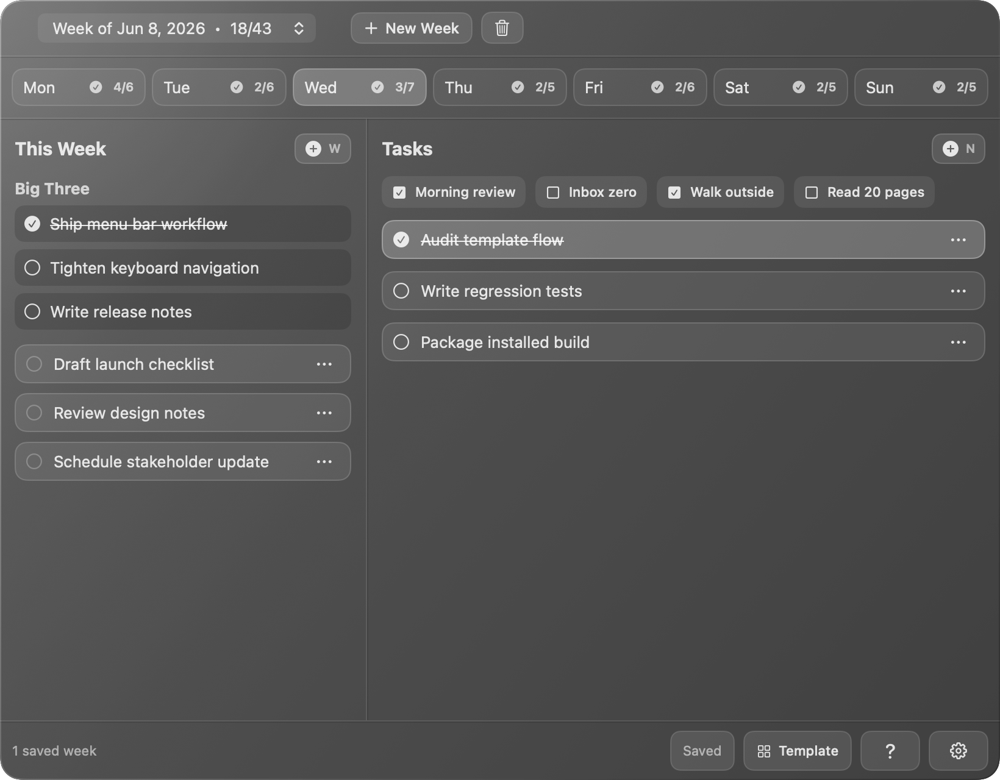
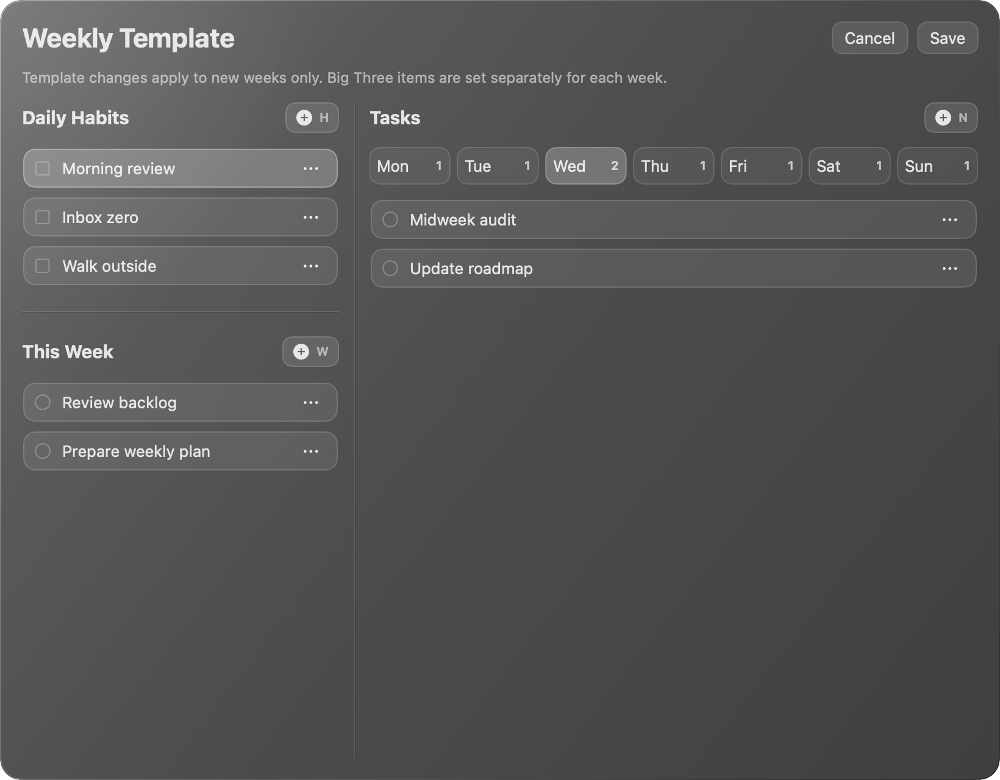

# Tasktarrasque

Tasktarrasque is a local macOS menu bar weekly task planner built with SwiftUI. It gives you one compact popover for weekly priorities, day-specific tasks, recurring templates, and keyboard-first task capture.

It stores data locally as JSON. There is no account system, server, analytics system, or cloud synchronization.

## Screenshots





## Features

- Menu bar application with no Dock icon.
- Weekly planning view with Monday-first day tabs.
- `This Week` list for unscheduled tasks.
- Day task lists with completion scores.
- `Big Three` section for the most important weekly goals.
- Weekly template editor for recurring habits, This Week items, and day-specific tasks.
- Keyboard shortcuts for creating, selecting, editing, moving, and deleting tasks.
- Local JSON persistence in Application Support.
- Optional pinned popover mode for keeping the app above other windows.

## Keyboard Shortcuts

| Shortcut | Action |
| --- | --- |
| `N` | Create a new task in the selected day. |
| `W` | Create a new task in This Week. |
| `H` | Create a new daily habit in the template editor. |
| `R` | Rename the selected item. |
| `Return` | Rename the selected item, or finish editing. |
| `D` | Mark the selected item done or not done. |
| `Delete` | Delete the selected task. |
| Arrow keys | Move selection between task rows. |
| `Shift-Up` / `Shift-Down` | Move the selected task up or down. |
| `Shift-Right` | Move a This Week task into the selected day. |
| `Shift-Left` | Move a day task back to This Week. |
| `?` | Show keyboard shortcuts. |
| `Escape` | Close panels, cancel editing, or clear selection. |

## Build and Run

From the repository root:

```sh
./build.sh
open build/Tasktarrasque.app
```

The build script compiles the Swift sources directly with `swiftc` and assembles a `.app` bundle. The bundle sets `LSUIElement=true`, so Tasktarrasque runs as a menu bar accessory.

For local testing from the same location as the normal installed app:

```sh
./build.sh --install
```

That command replaces `/Applications/Tasktarrasque.app`, quits any running Tasktarrasque instance, and launches the installed copy.

To quit the application, press `Command-Q`.

## Tests

Run the standalone model and controller test suite:

```sh
./run-tests.sh
```

The test runner compiles directly with `swiftc` and exits non-zero if any test fails.

## Screenshot Rendering

The screenshots in this README are generated from the actual SwiftUI views with seeded sample data:

```sh
mkdir -p .build/tools docs/screenshots
SDK_PATH="$(xcrun --show-sdk-path)"
ARCH="$(uname -m)"
TARGET="$ARCH-apple-macosx14.0"
swiftc \
  -target "$TARGET" \
  -sdk "$SDK_PATH" \
  -framework SwiftUI \
  -framework AppKit \
  Sources/Tasktarrasque/Models/TaskModels.swift \
  Sources/Tasktarrasque/Models/TaskInteractionModel.swift \
  Sources/Tasktarrasque/Models/NoteStore.swift \
  Sources/Tasktarrasque/Models/AppSettings.swift \
  Sources/Tasktarrasque/Models/AppController.swift \
  Sources/Tasktarrasque/Utilities/VisualEffectView.swift \
  Sources/Tasktarrasque/Utilities/Style.swift \
  Sources/Tasktarrasque/Views/SharedTaskComponents.swift \
  Sources/Tasktarrasque/Views/BottomBar.swift \
  Sources/Tasktarrasque/Views/KeyboardShortcutsSheet.swift \
  Sources/Tasktarrasque/Views/SettingsView.swift \
  Sources/Tasktarrasque/Views/TemplateSheet.swift \
  Sources/Tasktarrasque/Views/ContentView.swift \
  tools/render-screenshots.swift \
  -o .build/tools/render-screenshots
.build/tools/render-screenshots docs/screenshots
```

## Data Storage

Tasktarrasque stores data locally at:

```text
~/Library/Application Support/Tasktarrasque/weeks.json
```

If the JSON file cannot be decoded, Tasktarrasque preserves the unreadable file as a timestamped backup before creating a fresh store.

## Distribution

`build.sh` ad-hoc signs the bundle and the application is not sandboxed. That is fine for personal local use. Distribution to other machines would require a real signing identity and, ideally, the App Sandbox.
